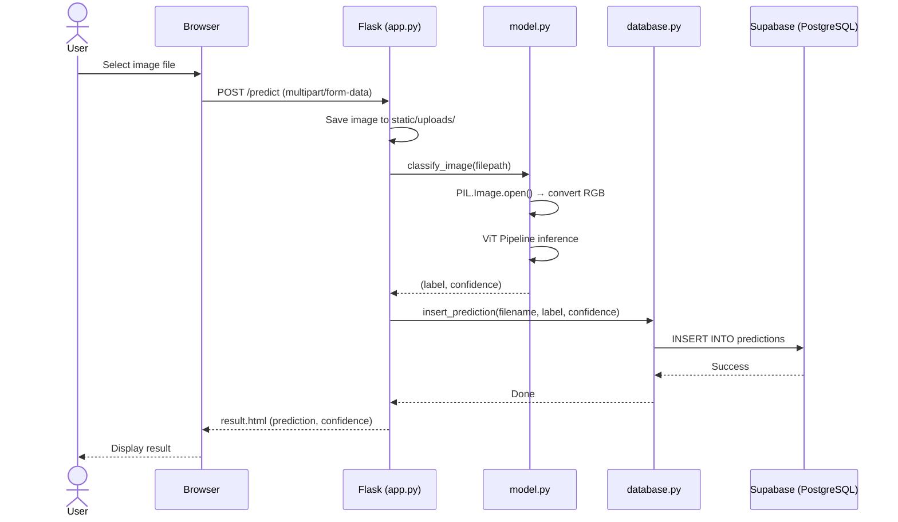

<p align="center">
  
</p>

<h1 align="center">🔬 VisionAI — Image Classifier</h1>

<p align="center">
  <em>A full-stack AI-powered image classification web application built with Flask, Hugging Face Transformers, and PostgreSQL (Supabase).</em>
</p>

<p align="center">
  
  
  
  
  
  
</p>

---

## 📑 Table of Contents

- [Overview](#-overview)
- [System Architecture](#-system-architecture)
- [Tech Stack](#-tech-stack)
- [Project Structure](#-project-structure)
- [Prerequisites](#-prerequisites)
- [Installation & Setup](#-installation--setup)
- [Environment Variables](#-environment-variables)
- [Database Setup](#-database-setup)
- [Running the Application](#-running-the-application)
- [API Routes](#-api-routes)
- [How It Works — End-to-End Flow](#-how-it-works--end-to-end-flow)
- [Key Files — Detailed Breakdown](#-key-files--detailed-breakdown)
- [Model Details](#-model-details)
- [Extending the Project](#-extending-the-project)
- [Troubleshooting](#-troubleshooting)
- [Contributing](#-contributing)
- [License](#-license)

---

## 🌐 Overview

**VisionAI — Image Classifier** is a web application that lets users upload any image and receive an instant AI-powered classification prediction. The application leverages Google's **Vision Transformer (ViT)** model from Hugging Face, served through a clean Flask web interface. Every prediction is persisted to a **Supabase PostgreSQL** database (with a local SQLite fallback), enabling a full prediction history dashboard.

### ✨ Key Features

| Feature | Description |
|---|---|
| 🖼️ **Image Upload** | Drag-and-drop or file-select interface for uploading images |
| 🤖 **AI Classification** | Instant predictions powered by `google/vit-base-patch16-224` |
| 📊 **Confidence Score** | Each prediction includes a percentage-based confidence score |
| 🗄️ **Prediction History** | All past predictions stored and viewable in a tabular dashboard |
| 🌐 **Cloud Database** | Supabase PostgreSQL for persistent, cloud-hosted storage |
| 💾 **Local Fallback** | SQLite database auto-initializes for offline/local development |

---

## 🏗️ System Architecture

```
┌─────────────────────────────────────────────────────────────────────┐
│                         CLIENT (Browser)                            │
│  ┌───────────┐    ┌──────────────┐    ┌───────────────────────┐    │
│  │ index.html│    │ result.html  │    │    history.html        │    │
│  │ (Upload)  │    │ (Prediction) │    │ (Prediction History)  │    │
│  └─────┬─────┘    └──────▲───────┘    └──────────▲────────────┘    │
│        │                 │                       │                  │
│        │  POST /predict  │   GET /               │   GET /history   │
└────────┼─────────────────┼───────────────────────┼──────────────────┘
         │                 │                       │
         ▼                 │                       │
┌─────────────────────────────────────────────────────────────────────┐
│                     FLASK SERVER (app.py)                            │
│                                                                     │
│  ┌──────────────────┐  ┌──────────────────┐  ┌───────────────────┐ │
│  │  Route: /         │  │ Route: /predict   │  │ Route: /history   │ │
│  │  Serves index     │  │ Handles upload    │  │ Fetches history   │ │
│  │  template         │  │ + classification  │  │ from database     │ │
│  └──────────────────┘  └────────┬───────────┘  └────────┬──────────┘ │
│                                 │                       │            │
│                    ┌────────────▼────────────┐          │            │
│                    │      model.py           │          │            │
│                    │  ┌──────────────────┐   │          │            │
│                    │  │ HuggingFace      │   │          │            │
│                    │  │ Transformers     │   │          │            │
│                    │  │ Pipeline         │   │          │            │
│                    │  │ (ViT Model)      │   │          │            │
│                    │  └──────────────────┘   │          │            │
│                    └─────────────────────────┘          │            │
│                                                         │            │
│                    ┌────────────────────────────────────▼──────────┐ │
│                    │            database.py                         │ │
│                    │  ┌─────────────────┐  ┌─────────────────────┐ │ │
│                    │  │ insert_prediction│  │   fetch_history     │ │ │
│                    │  └────────┬────────┘  └──────────┬──────────┘ │ │
│                    └───────────┼───────────────────────┼────────────┘ │
└────────────────────────────────┼───────────────────────┼─────────────┘
                                 │                       │
                                 ▼                       ▼
                    ┌──────────────────────────────────────────┐
                    │         SUPABASE (PostgreSQL)             │
                    │                                          │
                    │  Table: predictions                      │
                    │  ┌────────┬──────────┬────────────────┐  │
                    │  │ id     │ filename │ prediction     │  │
                    │  │ (PK)   │ (TEXT)   │ (TEXT)         │  │
                    │  │ AUTO   │          │                │  │
                    │  ├────────┤          ├────────────────┤  │
                    │  │        │          │ confidence     │  │
                    │  │        │          │ (REAL)         │  │
                    │  └────────┴──────────┴────────────────┘  │
                    │                                          │
                    │  Connection: psycopg2 via .env config    │
                    └──────────────────────────────────────────┘
```

### 🔄 Request-Response Flow

```
User uploads image
        │
        ▼
  POST /predict
        │
        ├──► Save file to static/uploads/ (UUID-prefixed)
        │
        ├──► model.py: classify_image()
        │       │
        │       ├──► PIL opens & converts image to RGB
        │       ├──► ViT pipeline runs inference
        │       └──► Returns (label, confidence%)
        │
        ├──► database.py: insert_prediction()
        │       │
        │       └──► INSERT INTO predictions via psycopg2
        │
        └──► Render result.html with prediction + confidence
```

---

## 🛠️ Tech Stack

### Backend

| Technology | Version | Purpose |
|---|---|---|
| **Python** | 3.10+ | Core programming language |
| **Flask** | 3.1.3 | Lightweight WSGI web framework |
| **Jinja2** | 3.1.6 | HTML templating engine (bundled with Flask) |
| **Werkzeug** | 3.1.8 | WSGI utility library for request/file handling |

### Machine Learning / AI

| Technology | Version | Purpose |
|---|---|---|
| **PyTorch** | 2.11.0 | Deep learning framework (model backend) |
| **Transformers** | 5.7.0 | Hugging Face library for pre-trained models |
| **Pillow (PIL)** | 12.2.0 | Image loading and preprocessing |
| **Tokenizers** | 0.22.2 | Fast tokenization (Transformers dependency) |
| **Safetensors** | 0.7.0 | Safe model weight serialization |

### Database

| Technology | Version | Purpose |
|---|---|---|
| **PostgreSQL** | (via Supabase) | Cloud-hosted relational database |
| **psycopg2-binary** | 2.9.12 | PostgreSQL adapter for Python |
| **SQLite** | (built-in) | Local fallback database for development |
| **python-dotenv** | 1.2.2 | Environment variable management from `.env` |

### Frontend

| Technology | Version | Purpose |
|---|---|---|
| **HTML5** | — | Page structure and semantics |
| **Bootstrap** | 5.3.x | Responsive UI framework (CDN-linked) |
| **Jinja2 Templates** | — | Server-side dynamic HTML rendering |

### Dev Tools & Utilities

| Technology | Purpose |
|---|---|
| **uuid** | Generates unique filenames to prevent collisions |
| **os** | File system operations and path management |
| **Git** | Version control |

---

## 📁 Project Structure

```
image_classifier/
│
├── app.py                  # Main Flask application — routes, config, server entry point
├── model.py                # AI inference module — loads ViT model, runs classification
├── database.py             # Database layer — Supabase PostgreSQL connection & queries
├── requirements.txt        # Python dependency manifest (pip freeze output)
├── .env                    # Environment variables (DB credentials) — NOT committed to git
├── .gitignore              # Git exclusion rules
├── .gitattributes          # Git line-ending normalization config
├── logo.png                # Project logo
├── README.md               # This documentation file
│
├── templates/              # Jinja2 HTML templates
│   ├── index.html          # Home page — image upload form
│   ├── result.html         # Prediction result display page
│   └── history.html        # Prediction history table page
│
├── static/                 # Static assets served by Flask
│   └── uploads/            # Uploaded images stored here (auto-created)
│
├── instance/               # Flask instance folder (auto-created)
│   └── classifier.db       # Local SQLite database (fallback)
│
├── .venv/                  # Python virtual environment (not committed)
└── __pycache__/            # Python bytecode cache (auto-generated)
```

---

## ✅ Prerequisites

Before setting up the project, ensure you have the following installed on your system:

| Requirement | Minimum Version | Verify Command | Installation Link |
|---|---|---|---|
| **Python** | 3.10+ | `python --version` | [python.org](https://www.python.org/downloads/) |
| **pip** | 21.0+ | `pip --version` | Bundled with Python |
| **Git** | 2.30+ | `git --version` | [git-scm.com](https://git-scm.com/) |
| **PostgreSQL Client** | _(optional)_ | `psql --version` | Only needed for manual DB inspection |

### Hardware Recommendations

| Component | Minimum | Recommended |
|---|---|---|
| **RAM** | 4 GB | 8 GB+ |
| **Disk Space** | 3 GB (model weights ~350 MB) | 5 GB+ |
| **GPU** | Not required | CUDA-capable GPU for faster inference |

> **Note:** The ViT model runs on CPU by default. First-time startup will download model weights (~350 MB) from Hugging Face Hub, so ensure a stable internet connection.

---

## 🚀 Installation & Setup

### Step 1 — Clone the Repository

```bash
git clone https://github.com/<your-username>/image_classifier.git
cd image_classifier
```

### Step 2 — Create a Python Virtual Environment

Creating an isolated virtual environment prevents dependency conflicts with other Python projects on your system.

**Windows (PowerShell):**
```powershell
python -m venv .venv
.\.venv\Scripts\Activate.ps1
```

**Windows (Command Prompt):**
```cmd
python -m venv .venv
.venv\Scripts\activate.bat
```

**macOS / Linux:**
```bash
python3 -m venv .venv
source .venv/bin/activate
```

> **Verify activation:** Your terminal prompt should now be prefixed with `(.venv)`.

### Step 3 — Install Dependencies

```bash
pip install -r requirements.txt
```

This installs all required packages including Flask, PyTorch, Transformers, psycopg2, and Pillow.

> **⚠️ First-time note:** PyTorch is a large package (~2 GB). The installation may take several minutes depending on your internet speed.

### Step 4 — Configure Environment Variables

Create a `.env` file in the project root (if not already present):

```bash
# Copy the example below and fill in your Supabase credentials
touch .env
```

```env
DB_HOST=your-supabase-host.pooler.supabase.com
DB_NAME=postgres
DB_USER=postgres.your-project-ref
DB_PASSWORD=your-secure-password
DB_PORT=5432
```

> See the [Environment Variables](#-environment-variables) section for detailed explanations.

### Step 5 — Run the Application

```bash
python app.py
```

The server will start on **`http://127.0.0.1:8000`**.

Open your browser and navigate to that URL. You're ready to classify images! 🎉

---

## 🔐 Environment Variables

The application uses a `.env` file (loaded via `python-dotenv`) to securely store database credentials. **This file is excluded from version control via `.gitignore`.**

| Variable | Description | Example Value |
|---|---|---|
| `DB_HOST` | Supabase PostgreSQL pooler hostname | `aws-1-ap-southeast-2.pooler.supabase.com` |
| `DB_NAME` | Database name (Supabase default is `postgres`) | `postgres` |
| `DB_USER` | Database user (format: `postgres.<project-ref>`) | `postgres.abcdefghijklmnop` |
| `DB_PASSWORD` | Database password (set during Supabase project creation) | `YourSecurePassword123!` |
| `DB_PORT` | PostgreSQL port (Supabase pooler default: `5432`) | `5432` |

### How to Get Supabase Credentials

1. Go to [supabase.com](https://supabase.com) and create a free account
2. Click **"New Project"** and note down the password you set
3. Navigate to **Settings → Database → Connection string → URI**
4. Extract the `host`, `user`, `password`, and `port` from the connection string
5. Populate your `.env` file with these values

---

## 🗄️ Database Setup

### Option A: Supabase PostgreSQL (Production / Cloud)

1. Log into your [Supabase Dashboard](https://app.supabase.com)
2. Open the **SQL Editor** and run the following DDL:

```sql
CREATE TABLE IF NOT EXISTS predictions (
    id SERIAL PRIMARY KEY,
    filename TEXT NOT NULL,
    prediction TEXT NOT NULL,
    confidence REAL NOT NULL
);
```

3. Ensure your `.env` credentials match the Supabase connection settings.

### Option B: Local SQLite (Development Fallback)

The application **automatically initializes a local SQLite database** at startup. The `init_db()` function in `app.py` creates the `predictions` table inside `instance/classifier.db` if it doesn't already exist.

> **Note:** The current codebase uses Supabase (PostgreSQL via `database.py`) for `insert_prediction` and `fetch_history`. The SQLite fallback in `app.py` is initialized but not actively used by the CRUD operations. To use SQLite instead, you would need to modify `database.py` to use `sqlite3` instead of `psycopg2`.

### Database Schema

```
┌─────────────────────────────────┐
│        predictions              │
├──────────────┬──────────────────┤
│ Column       │ Type             │
├──────────────┼──────────────────┤
│ id           │ INTEGER (PK, AI) │
│ filename     │ TEXT             │
│ prediction   │ TEXT             │
│ confidence   │ REAL             │
└──────────────┴──────────────────┘
```

- **`id`** — Auto-incrementing primary key
- **`filename`** — UUID-prefixed filename of the uploaded image (e.g., `a3f1b2c4_cat.jpg`)
- **`prediction`** — The top predicted class label from the ViT model (e.g., `"Egyptian cat"`)
- **`confidence`** — Confidence percentage as a float (e.g., `94.57`)

---

## ▶️ Running the Application

### Development Mode

```bash
# Activate virtual environment first
# Windows:
.\.venv\Scripts\Activate.ps1

# Then run:
python app.py
```

The app launches with `debug=True` on **port 8000**. Flask will auto-reload on code changes.

```
 * Serving Flask app 'app'
 * Debug mode: on
 * Running on http://127.0.0.1:8000
```

### First Launch — Model Download

On the **very first run**, the Hugging Face Transformers library will automatically download the ViT model weights:

```
Downloading model google/vit-base-patch16-224...
config.json: 100% ██████████████████████ 69.7k/69.7k
model.safetensors: 100% ██████████████████████ 346M/346M
preprocessor_config.json: 100% ██████████████████████ 160/160
```

This download happens **only once** and is cached in `~/.cache/huggingface/`.

---

## 🛤️ API Routes

| Method | Route | Description | Input | Output |
|---|---|---|---|---|
| `GET` | `/` | Home page with image upload form | — | `index.html` |
| `POST` | `/predict` | Accepts image, runs classification, saves result | `multipart/form-data` with `image` field | `result.html` with prediction & confidence |
| `GET` | `/history` | Displays all past predictions in a table | — | `history.html` with prediction history data |

### Route Details

#### `GET /`
Renders the main upload interface. The page includes:
- A file input for selecting images
- A "Predict" submit button
- A "View History" navigation link

#### `POST /predict`
Handles the complete prediction pipeline:
1. Extracts the uploaded file from the multipart form data
2. Generates a collision-safe filename using `uuid4()` + `secure_filename()`
3. Saves the file to `static/uploads/`
4. Calls `classify_image(filepath)` from `model.py`
5. Persists the result via `insert_prediction()` from `database.py`
6. Returns the result template with `prediction` and `confidence`

#### `GET /history`
Fetches all prediction records from the database (ordered by `id ASC`) and renders them in a Bootstrap-styled HTML table.

---

## 🔄 How It Works — End-to-End Flow



---

## 📄 Key Files — Detailed Breakdown

### `app.py` — Application Entry Point

| Aspect | Details |
|---|---|
| **Framework** | Flask 3.1.3 |
| **Port** | 8000 (configurable in `app.run()`) |
| **Debug Mode** | Enabled (`debug=True`) |
| **Upload Directory** | `static/uploads/` (auto-created via `os.makedirs`) |
| **Instance Path** | `instance/` (Flask convention for instance-specific data) |
| **Database Init** | `init_db()` creates SQLite table on startup |

**Key design decisions:**
- Uses `uuid.uuid4()` to prefix filenames, preventing overwrites when users upload files with identical names.
- `secure_filename()` from Werkzeug sanitizes user-provided filenames to prevent path traversal attacks.
- `instance_relative_config=True` tells Flask to look for instance-specific files in the `instance/` directory.

---

### `model.py` — AI Inference Engine

```python
# Pipeline is initialized ONCE at module load time (singleton pattern)
classifier = pipeline(
    "image-classification",
    model="google/vit-base-patch16-224"
)
```

| Aspect | Details |
|---|---|
| **Model** | `google/vit-base-patch16-224` |
| **Task** | Image Classification (ImageNet-1K, 1000 classes) |
| **Framework** | Hugging Face Transformers pipeline API |
| **Image Processing** | PIL converts to RGB before inference |
| **Output** | Top-1 prediction label + confidence score (0–100%) |

**How it works:**
1. The `pipeline()` call loads the model into memory **once** when the module is first imported
2. `classify_image()` opens the image, converts to RGB (handles RGBA/grayscale), runs inference
3. Returns the top-1 result's `label` and `score` (multiplied by 100 for percentage)

---

### `database.py` — Persistence Layer

| Aspect | Details |
|---|---|
| **Driver** | `psycopg2` (PostgreSQL adapter) |
| **Host** | Supabase connection pooler |
| **Auth** | Credentials loaded from `.env` via `python-dotenv` |

**Functions:**

| Function | Description |
|---|---|
| `get_connection()` | Creates a new psycopg2 connection to Supabase using env vars |
| `insert_prediction(filename, prediction, confidence)` | INSERTs a new row into the `predictions` table |
| `fetch_history()` | SELECTs all rows from `predictions`, ordered by `id ASC` |

> **⚠️ Developer Note:** Each function opens and closes a new database connection. For production use, consider implementing connection pooling (e.g., `psycopg2.pool.ThreadedConnectionPool` or Supabase's built-in pooler via PgBouncer).

---

### Templates

| Template | Route | Purpose |
|---|---|---|
| `index.html` | `/` | Upload form with Bootstrap styling + "View History" link |
| `result.html` | `/predict` | Displays prediction label and confidence percentage |
| `history.html` | `/history` | Renders all past predictions in a Bootstrap table |

---

## 🧠 Model Details

### Google Vision Transformer (ViT)

| Property | Value |
|---|---|
| **Full Name** | Vision Transformer Base (Patch16, 224px) |
| **Model ID** | `google/vit-base-patch16-224` |
| **Architecture** | Transformer Encoder (12 layers, 12 heads, 768 hidden) |
| **Input Resolution** | 224 × 224 pixels |
| **Patch Size** | 16 × 16 pixels (196 patches per image) |
| **Parameters** | ~86 million |
| **Training Data** | ImageNet-21K (pre-training) → ImageNet-1K (fine-tuning) |
| **Output Classes** | 1,000 (ImageNet categories) |
| **License** | Apache 2.0 |

### Supported Image Categories (Examples)

The model can classify images into **1,000 ImageNet categories**, including but not limited to:

| Category Group | Examples |
|---|---|
| 🐾 Animals | Egyptian cat, Golden retriever, Great white shark |
| 🚗 Vehicles | Sports car, Mountain bike, Airliner |
| 🍕 Food | Pizza, Ice cream, Cheeseburger |
| 🏠 Objects | Laptop, Sunglasses, Running shoe |
| 🌿 Nature | Daisy, Volcano, Coral reef |

---

## 🧩 Extending the Project

Here are some ideas for building on top of this foundation:

### 1. Add Custom CSS Styling
Create `static/style.css` and link it in your templates for a personalized look beyond Bootstrap defaults.

### 2. Support Multiple Predictions (Top-K)
Modify `model.py` to return the top-5 predictions instead of just the top-1:
```python
def classify_image(image_path, top_k=5):
    image = Image.open(image_path).convert("RGB")
    results = classifier(image, top_k=top_k)
    return [(r["label"], round(r["score"] * 100, 2)) for r in results]
```

### 3. Add Image Preview on Upload
Use JavaScript to show a preview of the selected image before submitting:
```javascript
document.querySelector('input[type="file"]').addEventListener('change', function(e) {
    const preview = document.createElement('img');
    preview.src = URL.createObjectURL(e.target.files[0]);
    preview.style.maxWidth = '300px';
    document.body.appendChild(preview);
});
```

### 4. Switch to SQLite for Local-Only Development
Replace `psycopg2` calls in `database.py` with `sqlite3`:
```python
import sqlite3, os

def get_connection():
    db_path = os.path.join("instance", "classifier.db")
    return sqlite3.connect(db_path)
```

### 5. Dockerize the Application
Create a `Dockerfile` for containerized deployment:
```dockerfile
FROM python:3.10-slim
WORKDIR /app
COPY requirements.txt .
RUN pip install --no-cache-dir -r requirements.txt
COPY . .
EXPOSE 8000
CMD ["python", "app.py"]
```

### 6. Add User Authentication
Integrate Flask-Login for user accounts, allowing each user to have their own prediction history.

### 7. Deploy to Production
Consider deploying with:
- **Gunicorn** as the WSGI server (instead of Flask's built-in dev server)
- **Google Cloud Run** for serverless container deployment
- **Railway** or **Render** for quick PaaS deployment

---

## 🐛 Troubleshooting

### Common Issues

| Problem | Cause | Solution |
|---|---|---|
| `ModuleNotFoundError: No module named 'torch'` | Virtual env not activated or dependencies missing | Activate `.venv` and run `pip install -r requirements.txt` |
| `psycopg2.OperationalError: could not connect to server` | Supabase credentials incorrect or network issue | Verify `.env` values match your Supabase dashboard |
| `OSError: Can't load tokenizer for 'google/vit-base-patch16-224'` | No internet on first run (model not cached) | Ensure internet connectivity for initial model download |
| `FileNotFoundError: static/uploads/` | Directory doesn't exist | The app auto-creates it; check write permissions |
| Port 8000 already in use | Another process occupies the port | Change port in `app.py`: `app.run(port=8001)` |
| Slow predictions | Running on CPU | Expected behavior; GPU acceleration requires CUDA-compatible PyTorch |

### Getting Help

1. Check the [Flask documentation](https://flask.palletsprojects.com/)
2. Check the [Hugging Face Transformers docs](https://huggingface.co/docs/transformers/)
3. Open an issue on the GitHub repository

---

## 🤝 Contributing

Contributions are welcome! Here's how to get started:

1. **Fork** the repository
2. **Create** a feature branch: `git checkout -b feature/my-new-feature`
3. **Commit** your changes: `git commit -m "Add: my new feature"`
4. **Push** to the branch: `git push origin feature/my-new-feature`
5. **Open** a Pull Request

### Code Style Guidelines

- Follow **PEP 8** for Python code
- Use **meaningful variable names**
- Add **docstrings** to new functions
- Keep functions **small and focused** (single responsibility)

---

## 📜 License

This project is open-source and available under the [MIT License](LICENSE).

---

<p align="center">
  Made with 🧠 + ❤️ using Flask, PyTorch & Hugging Face Transformers
</p>
